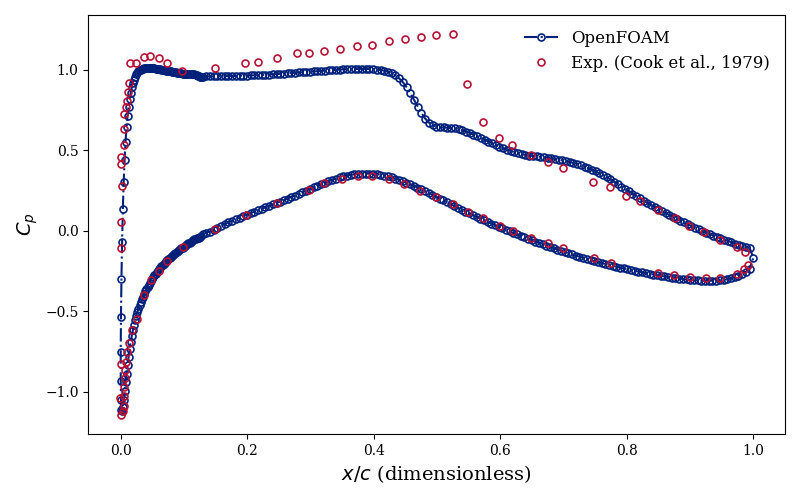
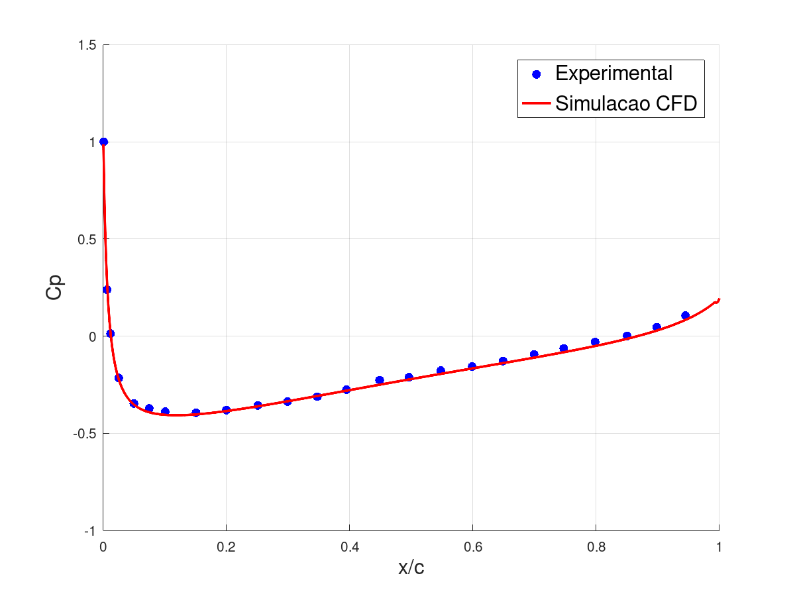

# OpenFOAM Simulations — External Aerodynamics

> A collection of CFD cases for external flow simulations using [OpenFOAM](https://www.openfoam.com/), covering compressible and incompressible regimes. Structured and hybrid meshes are generated with [Gmsh](https://gmsh.info/). Results include validation against experimental data where available.

---

## Repository Structure

```
OpenFOAM-Simulations/
├── compressible/
│   ├── NACA0012_CompressibleFlow/
│   └── RAE2822_Shock/
└── incompressible/
    ├── 2D_MultiElementWing/
    ├── NACA0012_StructuredMesh/
    └── NACA0012_UnstrucMesh/
```

---

## Cases

### Compressible

#### `NACA0012_CompressibleFlow`

Steady-state compressible flow over the NACA 0012 airfoil.

| Parameter | Value |
|-----------|-------|
| Solver | `rhoSimpleFoam` |
| Mesh | Structured (Gmsh) |
| Regime | Compressible / Subsonic–Transonic |

---

#### `RAE2822_Shock`

Transonic flow over the RAE 2822 airfoil, capturing shock-wave formation and interaction with the boundary layer.

| Parameter | Value |
|-----------|-------|
| Solver | `rhoPimpleFoam` |
| Mesh | Structured (Gmsh) |
| Regime | Compressible / Transonic |

Validation of pressure coefficient ($C_p$) distribution is compared against experimental data.

<!-- TODO: add validation figure here -->
<!--  -->



---

### Incompressible

#### `2D_MultiElementWing`

2D simulation of a multi-element wing configuration representative of a Formula 1 DRS (Drag Reduction System) assembly, using the NACA 6412 profile.

| Parameter | Value |
|-----------|-------|
| Solver | `simpleFoam` |
| Mesh | Hybrid — structured boundary layer (Gmsh) + unstructured far-field |
| Regime | Incompressible / Subsonic |

---

#### `NACA0012_StructuredMesh`

Incompressible flow over the NACA 0012 airfoil with a fully structured mesh. Results can be validated against experimental data.

| Parameter | Value |
|-----------|-------|
| Solver | `simpleFoam` |
| Mesh | Structured (Gmsh) |
| Regime | Incompressible / Subsonic |

---

#### `NACA0012_UnstrucMesh`

Incompressible flow over the NACA 0012 airfoil with an unstructured mesh. Aerodynamic coefficients ($C_l$, $C_d$, $C_p$) are validated against the experimental dataset from the [NASA Turbulence Modeling Resource](https://tmbwg.github.io/turbmodels/naca0012_val.html).

| Parameter | Value |
|-----------|-------|
| Solver | `simpleFoam` |
| Mesh | Unstructured (Gmsh) |
| Regime | Incompressible / Subsonic |

Validation figures comparing numerical results with experimental data are included in the case directory.

<!-- TODO: add validation figure here -->
<!--  -->



---

## Upcoming Cases

- **Flow Past a Wedge** — compressible wedge flow with oblique shock relations
- **Reactive Flows** — combustion and reacting flow simulations

---

## Requirements

- [OpenFOAM](https://www.openfoam.com/) (v2112 or newer recommended)
- [Gmsh](https://gmsh.info/) (for mesh generation)
- [ParaView](https://www.paraview.org/) (for post-processing)

---

## Running a Case

```bash
# Clone the repository
git clone https://github.com/TheoPalermoAerospace/OpenFOAM-Simulations.git
cd OpenFOAM-Simulations

# Navigate to the desired case, e.g.:
cd incompressible/NACA0012_UnstrucMesh

# Convert mesh to OpenFOAM format
gmshToFoam mesh.msh

# Run the solver
simpleFoam

# Post-process
paraFoam
```

> Each case directory contains its own `system/`, `constant/`, and `0/` folders following the standard OpenFOAM structure. Refer to the `README` inside each case (if available) for case-specific instructions.

---

## References

- NASA Turbulence Modeling Resource — NACA 0012 validation data: <https://tmbwg.github.io/turbmodels/naca0012_val.html>
- RAE 2822 experimental data: Cook, P. H., McDonald, M. A., & Firmin, M. C. P. (1979). *Aerofoil RAE 2822 — Pressure Distributions and Boundary Layer and Wake Measurements*. AGARD AR-138.
- OpenFOAM User Guide: <https://www.openfoam.com/documentation>
- Gmsh documentation: <https://gmsh.info/doc/texinfo/gmsh.html>

---

## Author

**Theo Palermo** — Aerospace Engineering  
[GitHub @TheoPalermoAerospace](https://github.com/TheoPalermoAerospace)

---

## License

This repository is licensed under the [MIT License](LICENSE).
